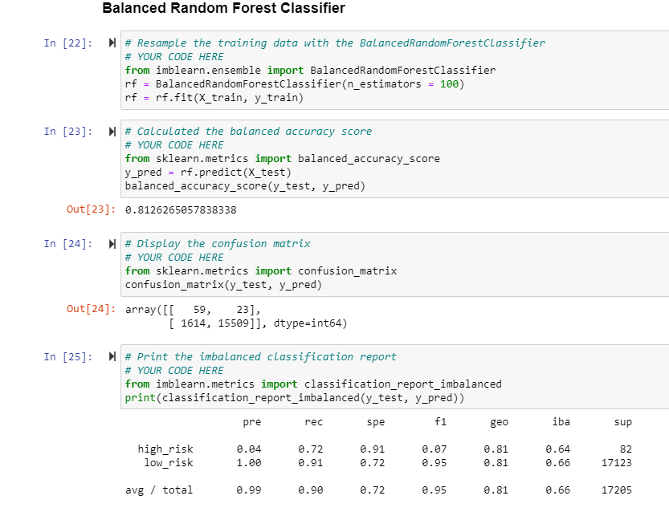

# Credit_Risk_Analysis

## Purpose of the analysis
Our main purpose here is to use different machine learning techniques to predict the credit risk.

## Results

* Naive Random Oversampling
Our balanced accuracy test is 65%, precision score is 99%, and recall scores is 60%

* SMOTE Oversampling
Our balanced accuracy test is 66%, precision score is 99%, and recall scores is 69%

* Undersampling
Our balanced accuracy test is 66%, precision score is 99%, and recall scores is 40%

* Combination (Over and Under sampling)
Our balanced accuracy test is 54%, precision score is 99%, and recall scores is 57%

* Balanced Random Forest Classifier
Our balanced accuracy test is 81%, precision score is 99%, and recall scores is 90%

* Easy Ensemble AdaBoost Classifier
Our balanced accuracy test is 90%, precision score is 99%, and recall scores is 94%

## Summary

Out of all six machine learning models, that we have tried:-
The 4 models consisting of oversampling, undersampling and the combinations, we tried to determine which model is best at predicting which loans are the highest risk. In these the accuracy scores are not desirably high, and recall scores are low too (good).

The next two models, using ensemble classifiers to try and predict what loans are high or low risk.
In these the accuracy scores are considerably high, and recall scores are high too (not good).

We have to look for a good balance of these factors, so as per these numbers from all 6 models, it is recommended that, the ensemble classifiers should be prefered over the first four models. It appears that the Easy Ensemble had the best balance of all the models because of it's high accuracy score and good balance of precision and recall scores.
